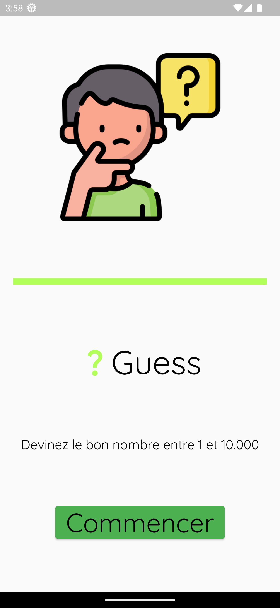
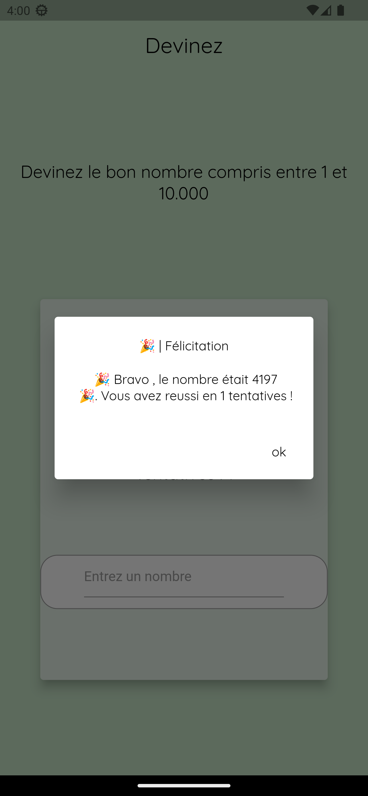

<h1 align="center">❓ | Geus</h1>

### Une petite application pour deviner le bon nombre fait en dart/flutter :)

### Mon serveur discord personnel : https://discord.gg/H3Aj3x2caw

<h1 align="center">Rendu de l'application</h1>

